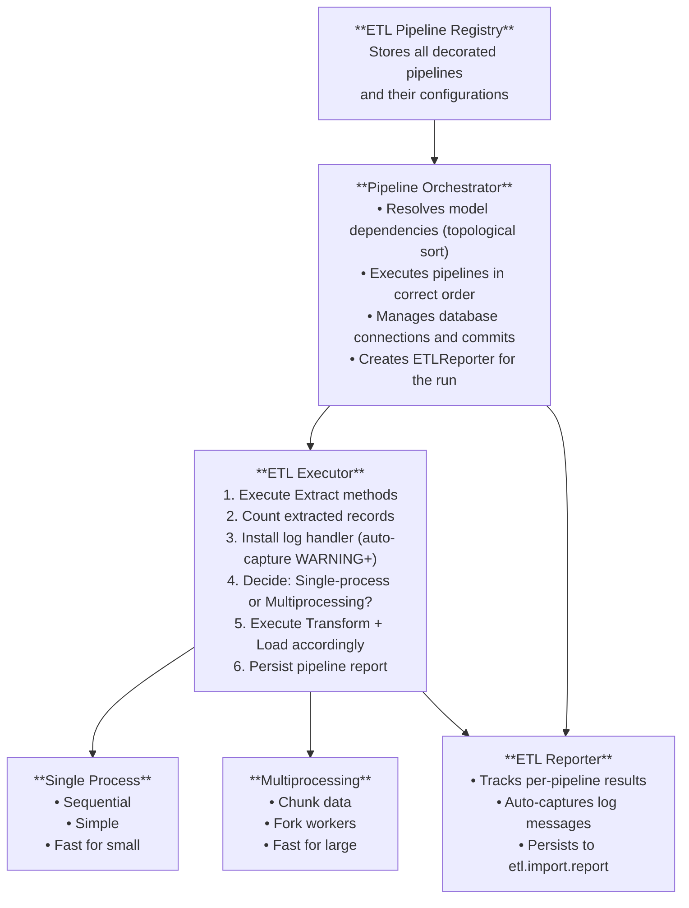

# ETL Framework for Odoo

**Version:** 2.3  
**Last Updated:** February 6, 2026

---

## Overview

A declarative, self-optimizing ETL framework for migrating data from external sources into Odoo. Provides clean separation between Extract, Transform, and Load phases with automatic multiprocessing optimization.

---

## Installation

Add `etl_framework` to your module's dependencies:

```python
# __manifest__.py
{
    "depends": ["etl_framework"],
}
```

Import the framework:

```python
from odoo.addons.etl_framework import ETL, ETLContext, PipelineOrchestrator
```

---

## Design Principles

### 1. **Declarative Over Imperative**
- Pipeline structure visible at class level through decorators
- Dependencies and execution order are explicit
- Minimal boilerplate code

### 2. **Self-Optimizing Execution**
- Framework automatically decides single-process vs. multiprocessing based on data volume
- No manual optimization decisions required
- Configurable thresholds per model

### 3. **Separation of Concerns**
- Clear separation between Extract, Transform, and Load phases
- Each phase can be tested independently
- Pure functions where possible (especially Transform)

### 4. **Memory Efficiency**
- No large data structures passed between steps
- Context object contains only cursors and environment references
- Data flows through pipeline without accumulation

### 5. **Fail Fast**
- Errors are logged with full traceback and re-raised
- No silent failures or recovery attempts
- Clear error messages for debugging

### 6. **Observable Execution**
- Built-in import reporting persisted to Odoo models
- Auto-capture of `WARNING` and `ERROR` log messages during pipeline execution
- Pipeline code can explicitly log successes, warnings, and failures via `ctx.report`
- Reports are browsable through the Odoo UI under **ETL > Import Reports**

---

## Architecture



---

## Core Components

### ETLContext
Lightweight context object passed to all ETL methods.

```python
@dataclass
class ETLContext:
    cr: Any                                    # Source database cursor
    env: Any                                   # Odoo environment
    source_config: Optional[Dict[str, Any]]    # Source-specific configuration

    def get_config(self, key: str, default: Any = None) -> Any:
        """Retrieve a configuration value."""

    @property
    def report(self) -> PipelineReport:
        """Access the active pipeline report (no-op if no reporter)."""
```

Example source configuration:
```python
source_config = {
    "source_id": 1,
    "source_model": "my.source.db",
    "filestore_path": "/path/to/files",
}
```

### MultiprocessingConfig
Configuration for dynamic multiprocessing decisions.

```python
@dataclass
class MultiprocessingConfig:
    enabled: bool = True              # Allow multiprocessing
    threshold: int = 1000             # Min records to trigger MP
    chunk_size: int = 500             # Records per chunk
    max_workers: Optional[int] = None # None = cpu_count - 1
    
    def should_use_multiprocessing(self, record_count: int) -> bool:
        return self.enabled and record_count >= self.threshold
```

### ETLPipeline
Declarative pipeline definition.

```python
@dataclass
class ETLPipeline:
    target_model: str                      # e.g., 'product.product'
    sap_source: str                        # e.g., 'oitm'
    depends_on: List[str]                  # Model dependencies
    multiprocessing: MultiprocessingConfig
    
    # Registered methods (populated by decorators)
    extract_methods: List[Callable]
    transform_methods: List[Callable]
    load_methods: List[Callable]
```

### ETL Decorators
Method registration decorators.

```python
class ETL:
    @classmethod
    def pipeline(cls, target_model, importer_name, sap_source=None, 
                 depends_on=None, multiprocessing_threshold=1000, 
                 chunk_size=500, max_workers=None, allow_multiprocessing=True):
        """Class decorator to define a pipeline"""
    
    @classmethod
    def extract(cls, source_table: str):
        """Method decorator for extraction"""
    
    @classmethod
    def transform(cls):
        """Method decorator for transformation"""
    
    @classmethod
    def load(cls):
        """Method decorator for loading"""
```

---

## Usage Examples

### Simple Model (No Multiprocessing)

```python
@ETL.pipeline(
    target_model='account.payment.term',
    importer_name='account.payment.term.importer',
    sap_source='octg',
    allow_multiprocessing=False,  # Always single-process
)
class AccountPaymentTermImporter(models.AbstractModel):
    _name = 'account.payment.term.importer'
    _description = 'SAP Payment Term Importer'
    
    @ETL.extract('octg')
    def extract_payment_terms(self, ctx: ETLContext) -> List[Dict]:
        ctx.cr.execute("SELECT * FROM octg")
        return ctx.cr.dictfetchall()
    
    @ETL.transform()
    def transform_payment_terms(self, ctx: ETLContext, extracted: Dict) -> List[Dict]:
        terms = extracted['extract_payment_terms']
        return [
            {
                "name": term["pymntgroup"],
                "sap_groupnum": term["groupnum"],
                "line_ids": [Command.create({
                    "value_amount": 100.0,
                    "value": "percent",
                    "nb_days": term["extradays"],
                })],
            }
            for term in terms
        ]
    
    @ETL.load()
    def load_payment_terms(self, ctx: ETLContext, transformed: Dict) -> None:
        term_vals = transformed['transform_payment_terms']
        ctx.env["account.payment.term"].create(term_vals)
```

### Complex Model (With Multiprocessing)

```python
@ETL.pipeline(
    target_model='sale.order',
    importer_name='sale.order.header.importer',
    sap_source='ordr',
    depends_on=['res.partner', 'account.payment.term', 'res.users'],
    multiprocessing_threshold=500,
    chunk_size=500,
    max_workers=8,
)
class SaleOrderHeaderImporter(models.AbstractModel):
    _name = 'sale.order.header.importer'
    _description = 'SAP Sale Order Header Importer (ORDR)'
    _inherit = 'sale.purchase.order.etl.mixin'
    
    _lookup_cache = {}
    
    @ETL.extract('ordr')
    def extract_headers(self, ctx: ETLContext) -> List[Dict]:
        # Get existing orders (idempotence)
        ctx.env.cr.execute(
            "SELECT DISTINCT sap_docnum FROM sale_order WHERE sap_docnum IS NOT NULL"
        )
        existing_docnums = tuple(row[0] for row in ctx.env.cr.fetchall())
        
        # Extract new order headers
        sql = "SELECT * FROM ordr"
        if existing_docnums:
            sql += " WHERE docnum NOT IN %s"
            ctx.cr.execute(SQL(sql, existing_docnums))
        else:
            ctx.cr.execute(sql)
        
        headers = ctx.cr.dictfetchall()
        
        # Pre-compute lookups for transform phase
        partners = ctx.env["res.partner"].search([...])
        partners_map = {partner.sap_card_code: partner.id for partner in partners}
        
        # Store in class-level cache (only primitive types!)
        SaleOrderHeaderImporter._lookup_cache = {
            "partners_map": partners_map,
            # ... other lookups
        }
        
        return headers
    
    @ETL.transform()
    def transform_headers(self, ctx: ETLContext, extracted: Dict) -> List[Dict]:
        headers = extracted['extract_headers']
        cache = SaleOrderHeaderImporter._lookup_cache
        
        order_vals = []
        for header in headers:
            partner_id = self.get_partner_id(header, cache)
            
            vals = {
                "sap_docnum": header["docnum"],
                "partner_id": partner_id,
                "date_order": fix_tz(header["docdate"]),
                # ... other fields
            }
            order_vals.append(vals)
        
        return order_vals
    
    @ETL.load()
    def load_headers(self, ctx: ETLContext, transformed: Dict) -> None:
        order_vals = transformed['transform_headers']
        if order_vals:
            orders = ctx.env["sale.order"].create(order_vals)
            _logger.info(f"Created {len(orders)} order headers.")
```

---

## Best Practices

### Multiprocessing
1. **Cache Primitive Types Only**: Store only IDs (integers/strings) in class-level caches, never Odoo recordsets
2. **Pre-compute in Extract**: Build all lookup dictionaries in the extract phase before multiprocessing begins
3. **Conservative Settings**: Start with lower worker counts (4-8) and larger chunk sizes (100-500)
4. **Error Propagation**: Remove try/except blocks in worker processes to ensure exceptions bubble up

### Idempotence
- Always filter existing records in the extract phase
- Use SAP's unique identifiers (docnum, itemcode, cardcode, etc.)
- For child records, use composite keys (e.g., `sap_parent_card` + `sap_address_linenum`)

### Data Quality
- **Negative quantities**: Filter out invalid data that violates Odoo constraints
- **Empty names**: Validate and provide fallbacks
- **Missing foreign keys**: Log warnings and skip records gracefully

### Split Pipeline Pattern
Complex models benefit from splitting into multiple pipelines:
1. **Parent records** - main entities
2. **Child records** - related entities
3. **Post-process** - link relationships

This allows:
- Independent idempotence checks
- Clearer separation of concerns
- Easier debugging
- Better multiprocessing control per pipeline

---

## Recommended Thresholds

| Model | Threshold | Chunk Size | Rationale |
|-------|-----------|------------|-----------|
| `product.product` | 1000 | 500 | Large datasets, CPU-intensive transforms |
| `res.partner` | 500 | 500 | Medium datasets, I/O intensive |
| `sale.order` | 500 | 500 | Medium datasets, complex transforms |
| `purchase.order` | 500 | 500 | Medium datasets, complex transforms |
| `ir.attachment` | 500 | 500 | File I/O intensive |
| `account.move` | 500 | 500 | Medium datasets |
| `mrp.bom` | 1000 | 500 | Large datasets |
| `account.payment.term` | ∞ (disabled) | N/A | Always small (<50 records) |
| `product.pricelist` | ∞ (disabled) | N/A | Always small |

---

## Troubleshooting

### Common Issues

**Issue**: `AttributeError: 'NoneType' object has no attribute 'id'`
- **Cause**: Trying to access recordset attributes in transform phase
- **Solution**: Pre-compute all lookups in extract phase, store only IDs in cache

**Issue**: Multiprocessing warnings about fork in multi-threaded process
- **Cause**: Debugpy and other tools warn about forking
- **Solution**: Framework automatically suppresses these warnings

**Issue**: Records being skipped
- **Cause**: Missing foreign key references (e.g., partner not found)
- **Solution**: Check logs for warnings, ensure dependencies are imported first

**Issue**: Duplicate records created
- **Cause**: Idempotence check not working
- **Solution**: Verify SAP unique field is correctly filtered in extract phase

**Issue**: `SerializationFailure: could not serialize access due to concurrent update`
- **Cause**: Multiple workers updating the same records (e.g., `res_partner.write_date`)
- **Solution**: Framework automatically retries with exponential backoff (up to 5 attempts). If persistent, reduce `max_workers` or increase `chunk_size`

**Issue**: Noisy "bad query" ERROR logs during multiprocessing
- **Cause**: PostgreSQL serialization failures logged by `odoo.sql_db`
- **Solution**: Framework v2.1+ automatically mutes these in worker processes. Errors still propagate for retry handling.

---

## Import Reporting

The framework automatically tracks every ETL run and persists results to Odoo models, viewable under **ETL > Import Reports**.

### Automatic Reporting

The following are tracked automatically with zero pipeline code changes:

- **Extracted record count** per pipeline (note: this reflects the total records returned by the extract phase, including records that may already exist in Odoo if the extract does not filter them)
- **Pipeline duration** and state (Done / Failed)
- **Uncaught exceptions** recorded as failure details
- **Logged warnings** (`_logger.warning(...)`) captured as report warnings
- **Logged errors** (`_logger.error(...)`) captured as report failures

Log messages from the `etl_framework` module itself (retry warnings, progress info, etc.) are excluded from capture.

### Explicit Reporting API

Pipelines can also log results explicitly via `ctx.report`:

```python
@ETL.load()
def load_records(self, ctx: ETLContext, transformed: dict):
    for vals in transformed.get("transform_records", []):
        try:
            ctx.env["res.partner"].create(vals)
            ctx.report.success()
        except Exception as e:
            # Log failure without raising — processing continues
            ctx.report.failure(message=str(e), source_ref=vals.get("name"))
```

Available methods on `ctx.report`:

| Method | Description |
|--------|-------------|
| `success(count=1)` | Increment success counter |
| `warning(message, source_ref=None)` | Log a warning detail |
| `failure(message, source_ref=None)` | Log a failure detail (non-throwing) |

If no reporter is active, `ctx.report` returns a no-op object — safe to call unconditionally.

### Report Models

| Model | Description |
|-------|-------------|
| `etl.import.report` | One record per ETL run (start/end time, totals, state) |
| `etl.import.report.line` | One record per pipeline (extracted count, success/warning/failure counts) |
| `etl.import.report.detail` | Individual warning/failure messages with source references |

---

## API Reference

See inline documentation in `framework.py` and `reporter.py` for complete API details.

---

## Changelog

### v2.3 (February 2026)
- **Import reporting**: Persistent ETL run reports with per-pipeline success/warning/failure tracking
- **Auto-capture of log messages**: `WARNING` and `ERROR` log messages during pipeline execution are automatically recorded as report details
- **Explicit reporting API**: Pipelines can log successes, warnings, and failures via `ctx.report` without raising exceptions
- **Browsable report views**: Tree and form views under **ETL > Import Reports** with state indicators and drill-down to details
- **Worker error handling**: Worker processes now rollback cleanly on error, preventing `InFailedSqlTransaction` from masking the original exception

### v2.2 (January 2026)
- **Generic source configuration**: Replaced SAP-specific `sap_db_id` with generic `source_config` dictionary
- **Extracted as standalone addon**: Framework is now a separate Odoo module, reusable across projects

### v2.1 (December 2025)
- **Automatic log muting**: Mutes `odoo.sql_db` logs in multiprocessing workers
- **Enhanced logging**: Log messages include `[importer_name]` prefix
- **Serialization retry**: Built-in retry with exponential backoff for PostgreSQL serialization failures

---

**Document Status:** Living document, updated as framework evolves.
